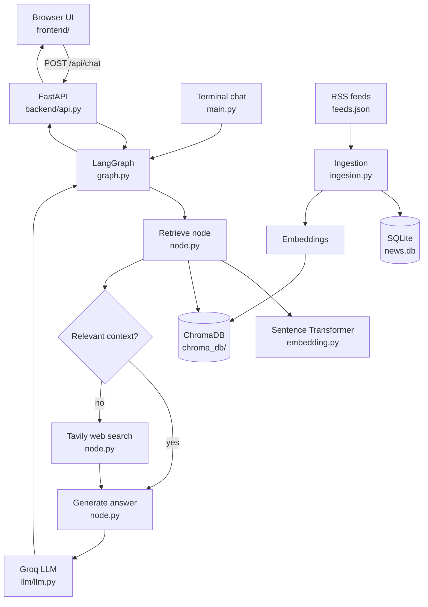

# News Agent Architecture

This project has two ways to use the same news agent:

1. The command-line interface in `main.py`.
2. The browser interface served by FastAPI.

Both interfaces eventually call the LangGraph application in `graph.py`.

## System Overview



## Frontend

Files:

- `frontend/index.html` - page structure and chat controls.
- `frontend/styles.css` - visual design and responsive layout.
- `frontend/app.js` - sends questions to the API and displays answers.

The browser sends this request:

```http
POST /api/chat
Content-Type: application/json

{"query": "What is happening in Israel?"}
```

The browser does not call the LLM directly. It only talks to FastAPI.

## Backend

File: `backend/api.py`

FastAPI provides:

- `GET /` - serves the frontend page.
- `GET /api/health` - confirms that the server is running.
- `POST /api/chat` - receives a question and returns an answer.

The existing agent is imported lazily inside `get_agent()`. This means the model and embedding system load when the first question is asked, rather than when the web server is only serving the page.

The backend invokes the graph with this state:

```python
{
    "query": question,
    "messages": [],
    "retrieved_docs": [],
}
```

## Agent Pipeline

File: `graph.py`

The graph connects these nodes:

1. `retrieve_node` searches ChromaDB using an embedding of the question.
2. `is_retrieval_sufficient` decides whether local context is usable.
3. `fallback_node` searches Tavily when web context is needed and preserves local results.
4. `generate_node` builds a context prompt and asks the Groq model for the answer.
5. The result is returned as `result["answer"]`.

File: `node.py`

This file contains the node behavior. It connects the graph to:

- `EmbeddingManager` from `embedding.py`.
- `collection` from `database/chromadb.py`.
- `model` from `llm/llm.py`.
- `TavilySearch` for web fallback.

## News Ingestion

File: `ingesion.py`

The ingestion process prepares the knowledge base used by retrieval:

1. Reads RSS URLs from `feeds.json`.
2. Stores article metadata in `news.db`.
3. Downloads and extracts article content.
4. Splits content into chunks with `processing/chunker.py`.
5. Creates embeddings with `embedding.py`.
6. Stores chunks and metadata in `chroma_db/`.

Run one ingestion cycle:

```bash
python ingesion.py
```

Run ingestion repeatedly every ten minutes:

```bash
python ingesion.py --watch
```

## Environment Variables

The `.env` file supplies credentials used by the agent:

- `GROQ_API_KEY` - answer generation.
- `TAVILY_API_KEY` - web fallback search.
- `GOOGLE_API_KEY` - available for compatible model integrations.

Do not commit `.env` or share its values.

## Running the System

Activate the virtual environment:

```bash
source myagenticenv/bin/activate
```

Start the web application:

```bash
uvicorn backend.api:app --reload
```

Open:

```text
http://127.0.0.1:8000
```

For continuous ingestion, use a second terminal:

```bash
source myagenticenv/bin/activate
python ingesion.py --watch
```

The web server and ingestion process are separate processes. Ingestion updates ChromaDB, while the backend reads from ChromaDB when a user asks a question.

## Important Separation

- `frontend/` is the browser interface.
- `backend/` is the HTTP API.
- `graph.py` is the agent workflow.
- `node.py` contains retrieval, fallback, and generation behavior.
- `ingesion.py` updates the searchable news data.
- `chroma_db/` stores searchable vectors.
- `news.db` stores article records.

The frontend and backend are new web files. The existing CLI and ingestion behavior remain available separately.
